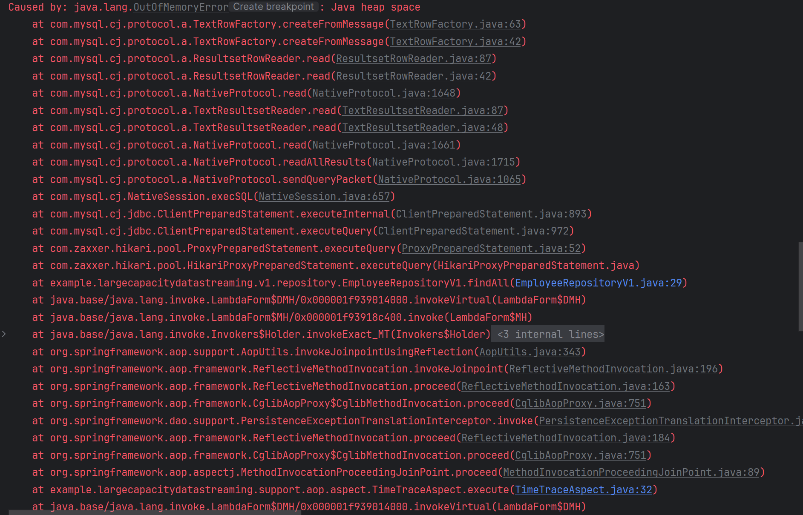
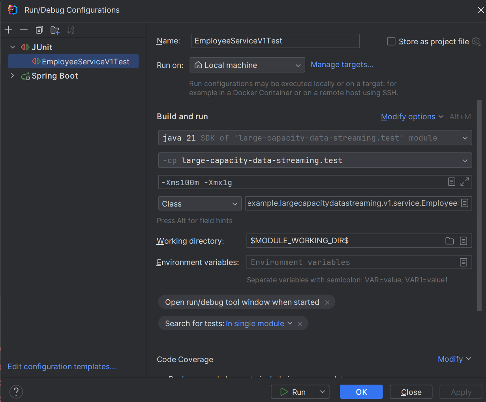
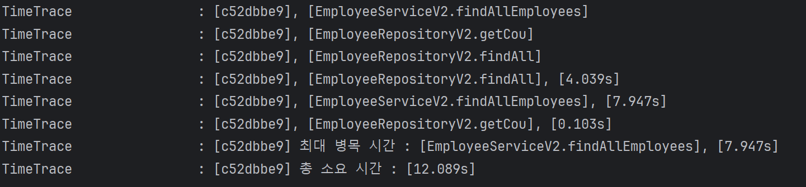
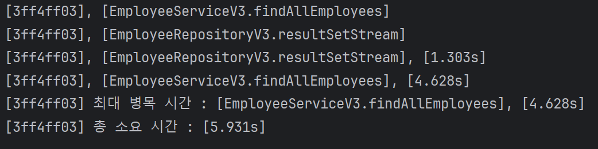
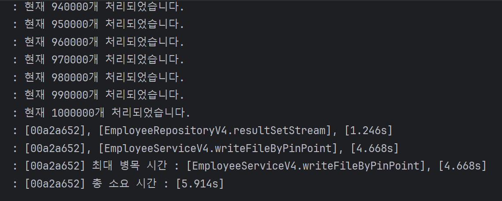
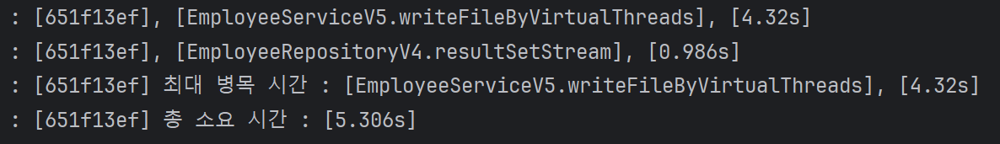

## 개요

간단한 예제를 통해 명령형, 선언형 프로그래밍에 대한 차이점을 알아보고, 자바 스트림 API를 사용해서 여러가지의 작업을 하나의 연속적인 흐름으로 처리하는 방법에 대해서 알아보는 예제입니다.

예제는 100만건의 데이터를 조회 하고, 간단한 연산 작업 후 파일로 저장하는 공통적인 로직으로 구성되어 있습니다.

V1 ~ V5로 구성되어 있습니다. 가장 간단한 명령형 예제부터 시작해서, Virtual Thread를 활용한 선언형 예제 까지, 

각 예제에서 발생하는 문제점을 다음 버전으로 해결 해 나가는 방식으로 설계했습니다.

## v1

```java
public <T> List<T> findAll(RowMapper<T> rowMapper) {
    int rowNum = 0;
    String sql = "SELECT * FROM employee";

    try (Connection connection = DataSourceUtils.getConnection(dataSource);
         PreparedStatement pStmt = connection.prepareStatement(sql);
         ResultSet rs = pStmt.executeQuery()
    ) {
        List<T> tList = new ArrayList<>();

        while (rs.next()) {
            tList.add(rowMapper.mapRow(rs, rowNum++));
        }

        return tList;
    } catch (SQLException e) {
        throw new RuntimeException(e);
    }
}
```

```java
public List<EmployeeDto> findAllEmployees() {
    List<Employee> employees = employeeRepositoryV1.findAll((rs, rowNum) -> new Employee(
            rs.getString("first_name"),
            rs.getString("last_name"),
            rs.getString("email"),
            rs.getString("department"),
            rs.getDouble("salary"),
            rs.getDate("hire_date")
    ));

    List<EmployeeDto> employeesDto = new ArrayList<>();

    for (Employee employee : employees) {
        employeesDto.add(EmployeeDto.create(employee));
    }

    return employeesDto;
}

public void writeFile(String filePath) {
    List<EmployeeDto> allEmployees = findAllEmployees();

    fileWriteService.writeHeader(EmployeeDto.class, filePath);
    fileWriteService.writeBody(EmployeeDto.class, allEmployees, filePath);
}
```

전통적인 명령형 프로그래밍 방식 입니다. DB에서 모든 데이터를 조회해온 후에, 팩토리 메서드 패턴을 적용한 DTO 클래스의 create 메서드를 호출해서 간단한 변환을 진행 후, 리스트에 담아줍니다.

그 후에 writeFile 메서드를 통해 파일을 생성합니다.

테스트를 진행해봅니다.

## 문제점



OOM 에러가 발생했는데, 왜 이런 문제가 발생하는걸까요?

그 이유는 어플리케이션을 실행할 때 설정한 자바의 힙 메모리가 DB에서 조회해온 데이터를 List에 저장할 때, 초과해버리기 때문입니다.

가장 간단한 해결방법은 어플리케이션을 실행할 때 자바의 힙 메모리 사이즈를 스케일업해서 실행하는 것입니다.

## 해결



이걸로 과연 문제는 해결됐습니다.

**하지만 DB의 데이터가 계속해서 늘어난다고 가정했을 때, 단편적인 스케일업 방식으로 해결한 게 좋은 방식인지는 장담할 수 없습니다.** 

## v2

```java
public int getCount() {
    String sql = "SELECT COUNT(*) FROM employee";
    int count = 0;
    try (Connection connection = DataSourceUtils.getConnection(dataSource);
         PreparedStatement pStmt = connection.prepareStatement(sql);
    ) {
        try (ResultSet rs = pStmt.executeQuery()) {

            if (rs.next()) {
                count = rs.getInt(1);
            }

            return count;
        }
    } catch (SQLException e) {
        throw new RuntimeException(e);
    }
}

public <T> List<T> findAll(RowMapper<T> rowMapper, int start, int end) {
    int rowNum = 0;
    String sql = "SELECT * FROM employee LIMIT ?, ?";

    try (Connection connection = DataSourceUtils.getConnection(dataSource);
         PreparedStatement pStmt = connection.prepareStatement(sql);
    ) {
        pStmt.setInt(1, start);
        pStmt.setInt(2, end - start);

        try (ResultSet rs = pStmt.executeQuery()) {
            List<T> tList = new ArrayList<>();

            while (rs.next()) {
                tList.add(rowMapper.mapRow(rs, rowNum++));
            }

            return tList;
        }
    } catch (SQLException e) {
        throw new RuntimeException(e);
    }
}
```


```java
public void findAllEmployees(String filePath) {
    fileWriteService.writeHeader(EmployeeDto.class, filePath);

    int pageSize = 100_000;
    int totalRecords = employeeRepositoryV2.getCount();

    for (int start = 0; start < totalRecords; start += pageSize) {
        int end = Math.min(start + pageSize, totalRecords);

        List<Employee> employees = employeeRepositoryV2.findAll((rs, rowNum) -> new Employee(
                rs.getString("first_name"),
                rs.getString("last_name"),
                rs.getString("email"),
                rs.getString("department"),
                rs.getDouble("salary"),
                rs.getDate("hire_date")
        ), start, end);

        List<EmployeeDto> employeesDto = new ArrayList<>();

        for (Employee employee : employees) {
            employeesDto.add(EmployeeDto.create(employee));
        }

        fileWriteService.writeBody(EmployeeDto.class, employeesDto, filePath);
    }
}
```

두 번째 방식 또한 전통적인 명령형 프로그래밍 방식인데, 스케일업 하지 않고도 기능을 수행하기 위해 페이징 쿼리를 통해 로직을 수행했습니다.

먼저, 쿼리에서 얼마만큼의 데이터가 있는지 확인하기 위한 Count 쿼리를 수행한 후에, 반복문을 통해 데이터를 십만 건 씩 가져와 공통 로직을 수행합니다.

테스트는 정상적으로 수행됐고, 파일 또한 잘 만들어진 걸 확인할 수 있습니다.

## 문제점

이 로직은 카운트를 조회하는 쿼리 외에도 페이지 크기에 따라 추가적인 쿼리를 수행합니다. 

따라서, 데이터 소스에서 커넥션을 가져와 DB 서버와 통신하는 과정을 페이지 크기만큼 반복해야 합니다.

이는 DB 커넥션 점유시간이 늘어나고, DB 서버에 상대적으로 더 큰 부하를 줄 수 있습니다.

뿐만 아니라 잦은 데이터베이스 I/O로 인해, 효율성 또한 떨어집니다.



## v3

세 번째 방식부터는 드디어 자바의 Stream API를 사용하여 이전까지 겪어왔던 문제를 해결합니다.

```java
public void findAllEmployees(String filePath) {
    fileWriteService.writeHeader(EmployeeDto.class, filePath);

    employeeRepositoryV3.resultSetStream((rs, rowNum) -> new Employee(
                    rs.getString("first_name"),
                    rs.getString("last_name"),
                    rs.getString("email"),
                    rs.getString("department"),
                    rs.getDouble("salary"),
                    rs.getDate("hire_date")))
            .map(EmployeeDto::create)
            .forEach(employeeDto -> fileWriteService.writeBody(EmployeeDto.class, employeeDto, filePath));
}
```

resultSetStream 메서드의 내부로 들어가서 로직을 좀 더 자세하게 살펴보겠습니다.

```java
public <T> Stream<T> resultSetStream(RowMapper<T> rowMapper) {
    String sql = "SELECT * FROM employee";

    try {
        return CustomSpliterator.queryForStream(dataSource, sql, rowMapper);
    } catch (SQLException e) {
        throw new RuntimeException(e);
    }
}
```

CustomSpliterator 클래스의 팩토리 메서드를 사용해서 Stream 타입을 return 해주는 메서드입니다. 

CustomSpliterator 클래스는 Spliterator 인터페이스의 구현체인데, 네 가지의 추상 메서드를 구현했습니다. 가장 중요한 tryAdvance 메서드를 살펴보겠습니다.

```java
private static class CustomSpliterator<T> implements Spliterator<T> {

    private int rowNum = 0;

    private final ResultSet rs;

    private final RowMapper<T> rowMapper;


    public CustomSpliterator(ResultSet rs, RowMapper<T> rowMapper) {
        this.rs = rs;
        this.rowMapper = rowMapper;
    }

    public static <T> Stream<T> queryForStream(DataSource dataSource, String sql, RowMapper<T> rowMapper) throws SQLException {
        Connection connection = DataSourceUtils.getConnection(dataSource);
        Statement stmt = connection.createStatement();
        ResultSet rs = stmt.executeQuery(sql);

        return StreamSupport.stream(new CustomSpliterator<>(rs, rowMapper), false).onClose(() -> {
            JdbcUtils.closeResultSet(rs);
            JdbcUtils.closeStatement(stmt);
            DataSourceUtils.releaseConnection(connection, dataSource);
        });
    }

    @Override
    public boolean tryAdvance(Consumer<? super T> consumer) {
        try {
            if (rs.next()) {
                consumer.accept(rowMapper.mapRow(rs, rowNum++));

                return true;
            } else {
                return false;
            }
        } catch (SQLException e) {
            throw new RuntimeException(e);
        }
    }

    @Override
    public Spliterator<T> trySplit() {
        return null;
    }

    @Override
    public long estimateSize() {
        return 0;
    }

    @Override
    public int characteristics() {
        return ORDERED;
    }
}
```

ResultSet에서 다음 요소가 존재할 경우에 RowMapper를 반환하도록 하여, 스트림의 중간 연산으로 RowMapper 객체에 대한 작업이 가능하도록 구현했습니다.

중간 연산 이후 최종연산을 통해 파일에 쓰기 작업을 수행함으로써, 여러가지 작업을 하나의 흐름으로 처리하는 것에 성공했습니다.

테스트 결과를 확인해보면 다음과 같습니다.



이전 방식에 비해 커넥션 점유시간이 짧아졌고, 전체적인 처리 효율성이 높아졌습니다.

이는 BufferedWriter의 특성과도 관련이 있는데, 버퍼에 작업내용을 모아서 한번에 flush 해줌으로써 forEach문으로 fileWrite 로직을 사용해도 I/O 작업이 많이 발생하지 않습니다.

## 고려할 점
사실 queryForStream 메서드의 경우, JdbcTemplate에서 똑같은 기능을 지원해주는 메서드가 있습니다. 하지만 커스텀하게 구현했을 경우 개발자가 추가적으로 필요한 기능을 넣어줄 수 있습니다.

V4에서는 데이터 스트림 처리 도중에 추가적인 작업을 수행할 수 있도록 커스텀하게 구현해보겠습니다.

## v4

```java
public static <T> Stream<T> queryForStream(DataSource dataSource,
                                           String sql,
                                           RowMapper<T> rowMapper,
                                           Consumer<Integer> listener) throws SQLException {
    ComfortableConnection connection = new ComfortableConnection(dataSource, sql);

    return StreamSupport.stream(new CustomSpliterator<>(connection.resultSet, rowMapper)
            .pinned(listener), false)
            .onClose(connection::close);
}
```

이 예제에서는 queryForStream 메서드를 커스텀하여, Consumer 함수형 인터페이스를 파라미터로 받아 특정 지점(bulkPoint)에서 원하는 동작을 실행할 수 있도록 확장했습니다.

```java
private static class CustomSpliterator<T> implements Spliterator<T> {

    private static final int DEFAULT_BULK_POINT = 10_000;

    private int bulkPoint = DEFAULT_BULK_POINT;

    private int rowNum = 0;

    private Consumer<Integer> listener;

    ...

    public EmployeeRepositoryV4.CustomSpliterator<T> pinned(Consumer<Integer> listener) {
        this.listener = listener;

        return this;
    }
```

CustomSpliterator 클래스의 필드로 listener, bulkPoint 라는 변수가 생겼고, 파라미터로 받은 Consumer 함수형 인터페이스로 초기화해줍니다.

bulkPoint는 default로 받거나, 혹은 생성자를 통해 직접 주입받을 수 있습니다.

tryAdvance 메서드를 살펴보면, 새로운 조건문이 포함된 것을 볼 수 있습니다.

```java
@Override
public boolean tryAdvance(Consumer<? super T> consumer) {
    try {
        if (rs.next()) {
            T t = rowMapper.mapRow(rs, rowNum++);
            consumer.accept(t);

            if (rowNum > 0 && rowNum % bulkPoint == 0) {
                listener.accept(rowNum);
            }

            return true;
        } else {
            if (rowNum > 0 && rowNum % bulkPoint != 0) {
                listener.accept(rowNum);
            }
            return false;
        }
    } catch (SQLException e) {
        throw new RuntimeException(e);
    }
}
```

이를 통해 resultSetStream에 rowNum을 로깅하는 새로운 파라미터를 추가하였고, 이 조건문이 참이 될 때마다 로그를 출력하도록 설정되어 있습니다.

```java
public void writeFileByPinPoint(String filePath) {
    fileWriteService.writeHeader(EmployeeDto.class, filePath);

    BufferedWriter bufferedWriter = fileWriteService.getBufferedWriter(filePath);

    employeeRepositoryV4.resultSetStream((rs, rowNum) -> new Employee(
                    rs.getString("first_name"),
                    rs.getString("last_name"),
                    rs.getString("email"),
                    rs.getString("department"),
                    rs.getDouble("salary"),
                    rs.getDate("hire_date")
            ), rowNum -> log.info("현재 {}개 처리되었습니다.", rowNum))
            .map(EmployeeDto::create)
            .forEach(employeeDto -> fileWriteService.writeBody(employeeDto, bufferedWriter));
}
```

간단히 말해, 10,000건마다 로그를 출력하도록 구성된 것입니다.

<b>이러한 커스텀 구현을 통해, 표준 기능을 넘어서는 유연성과 확장성을 얻을 수 있습니다.</b>



## 고려할 점
싱글 쓰레드 기반 어플리케이션의 I/O 작업에는 필시 blocking이 발생하기 마련입니다.

V5에서는 I/O 작업 수행 시 멀티 쓰레드를 활용해서 성능을 개선해보겠습니다.

## v5
기존 V4 코드 대비해서 변화한건 파일 처리를 새로운 쓰레드 생성과 함께 수행하는 것입니다.

** <b>예제를 간소화하기 위해 쓰레드의 생성과 실행을 분리하지 않았으며, 생명 주기는 고려하지 않았습니다.</b>

V5에서는 버츄얼 쓰레드 모델을 사용해 성능차이를 확인해보도록 하겠습니다.

V5에서는 서비스 로직에서 사용되는 FileWriteService의 writeBody 메서드에 파라미터가 하나 추가되었습니다.

```java
    public void writeBody(Queue<T> data, BufferedWriter bufferedWriter, Consumer<BufferedWriter> listener) {
    try {
        while (!data.isEmpty()) {
            createBody((SerializableCustom) data.poll(), bufferedWriter);
        }

        listener.accept(bufferedWriter);
    } catch (IOException e) {
        throw new RuntimeException(e);
    }
}
```

listener로 사용되는 메서드는 다음과 같이 BufferedWriter에서 flush가 일어나 IO작업을 수행할 때 새로운 버츄얼 쓰레드로 스위칭해 대기시간이 최대한 발생하지 않게 구현했습니다.

```java
public static Consumer<BufferedWriter> writeByThreads() {
    return writer -> Thread.ofVirtual().start(() -> {
        try {
            writer.flush();
        } catch (IOException e) {
            throw new RuntimeException(e);
        }
    });
}
```



데이터의 용량이 크지 않고 flush의 시점이 while문 내에서 발생할 수도 있기 때문에 크게 차이가나진 않습니다.

다만, 데이터가 커질수록, I/O작업이 많아질수록 효율성은 높아질 것으로 예상됩니다.

## 결론

V1 ~ V5까지의 과정을 통해 함수형 인터페이스, 스트림, 람다 등을 활용한 성능 개선 과정을 기록해봤습니다.